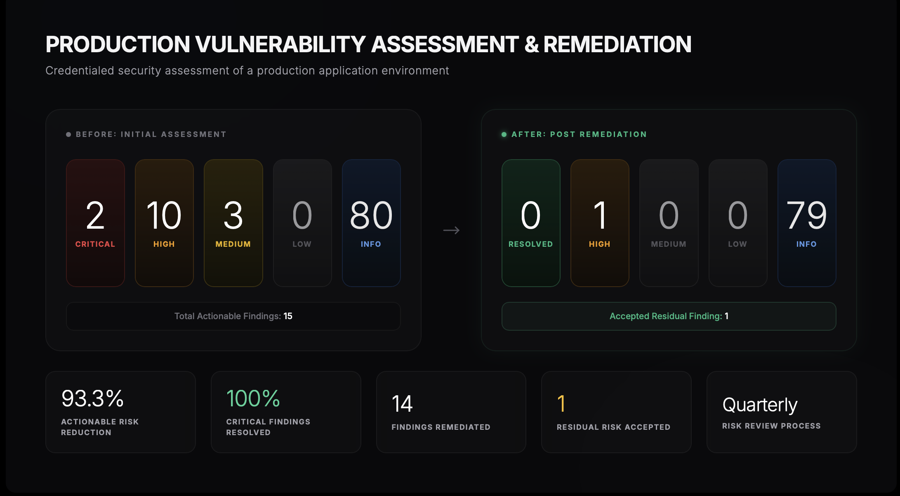
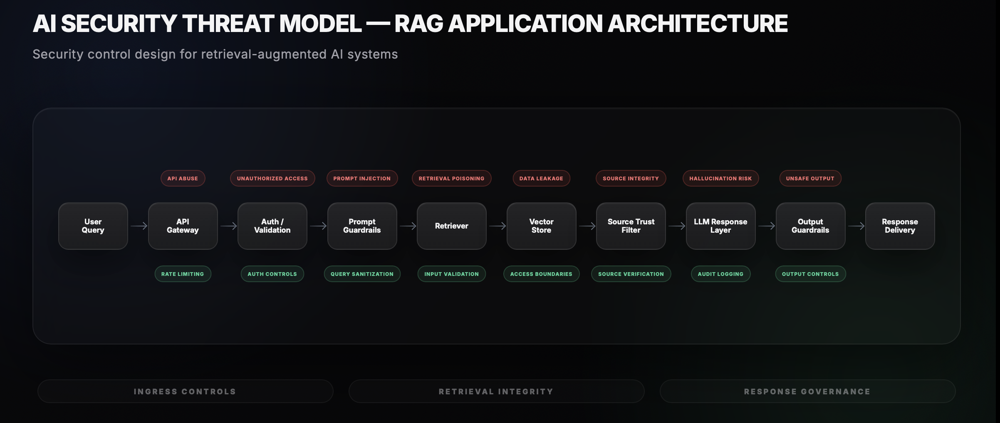

# Security Portfolio — Steeve Joseph

**Security+ Certified | AI Security | Vulnerability Management | GRC Translation**

Real security work across production AI systems, infrastructure hardening, and AI security research.

This repository documents practical security work, not classroom labs.

---

## What This Portfolio Shows

- Production vulnerability assessment & remediation
- AI / RAG security architecture
- Risk identification and mitigation
- Compliance-to-technical control translation
- Security documentation for technical and executive audiences

---

## Featured Projects

### 1. Production Vulnerability Assessment & Remediation

Credentialed Nessus security assessment of a live production AI application environment running on Ubuntu 24.04 LTS.



**Scope**

- Host vulnerability analysis
- Package exposure review
- Patch remediation planning
- Risk prioritization
- Remediation execution
- Residual risk documentation

**Outcome**

- 15 actionable vulnerabilities identified
- 2 critical findings (CVSS 9.8)
- 14 remediated in first remediation cycle
- 1 risk documented with compensating controls

**Skills Demonstrated**

- Vulnerability management
- CVE triage
- Risk analysis
- Patch governance
- Linux remediation workflows
- Security reporting

**Artifacts**

- [Redacted Findings Report](./artifacts/redacted-findings.md)
- [Remediation Decision Log](./artifacts/remediation-log.md)

---

### 2. AI / RAG Security Architecture — AskObi

Security architecture analysis and control design for a production retrieval-augmented generation platform.



**Focus Areas**

- API access control
- Source trust enforcement
- Prompt injection risk
- Hallucination containment
- Retrieval integrity
- Vector security considerations
- Application-layer validation

**Skills Demonstrated**

- AI security architecture
- Threat modeling
- Trust boundary analysis
- Secure API design
- Adversarial AI risk mitigation

**Artifacts**

- [RAG Threat Model](./artifacts/rag-threat-model.md)

---

## Technical Environment

**Security**
Nessus · CVSS · EPSS · vulnerability triage · remediation governance · risk documentation

**Infrastructure**
Linux · Ubuntu 24.04 LTS · server hardening · package management · secure deployment workflows

**Application Security**
API validation · authentication controls · input sanitization · trust boundary analysis

**AI Security**
RAG architecture · LLM threat modeling · prompt security · retrieval integrity · adversarial AI analysis

**Compliance / Governance**
Control mapping · policy-to-technical translation · audit documentation · operational governance

---

## Professional Background

**Compliance Foundation**

- HIPAA-regulated operational leadership
- Zero violation operational environment
- Regulated aviation exposure (FAA / TSA / DHS)
- Licensed financial services compliance exposure

**Technical Foundation**

Builder/operator of production AI systems with practical security ownership.

---

## Certifications

- CompTIA Security+ (SY0-701)

---

## Repository Structure

```text
/artifacts
    redacted-findings.md
    remediation-log.md
    rag-threat-model.md

/images
    ai-security-threat.png
    vuln-rem-dashboard.png
```
